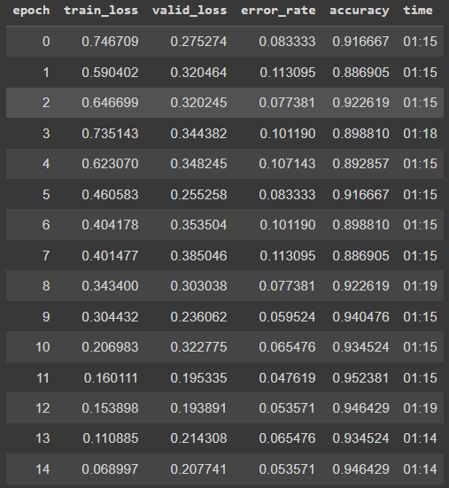
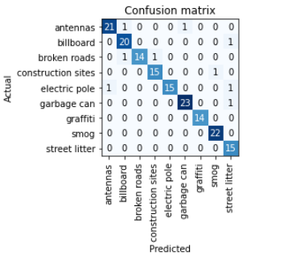
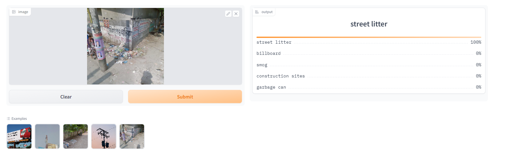

# Visual Pollution Recognizer

## Visual Pollution

Our first impression of a society is formed by its appearance, which is frequently a patchwork of man-made buildings and natural structures. All irregular structures that are unappealing and
out of context to its surroundings prevent people from enjoying their surroundings. The term Visual Pollution is defined as all the unsightly objects that are out of context to its surroundings and ruins the aesthetic quality of its surrounding landscape which causes harm to human vision and health. So I have made a classifier to detect visual pollutants.

## Classifier

An image classification model from data collection, cleaning, model training, deployment and API integration.  
The model can classify 9 different types of visual pollutants  
The types are following:  

1. Street litter
2. Garbage can,
3. Electric pole,
4. Billboard,
5. Graffiti,
6. Smog,
7. Broken roads,
8. Antennas,
9. Construction sites

# Dataset Preparation

**Data Collection:** Downloaded from DuckDuckGo using term name  
**DataLoader:** Used fastai DataBlock API to set up the DataLoader.  
**Data Augmentation:** fastai provides default data augmentation which operates in GPU.  
Details can be found in `notebooks/data_prep.ipynb`

# Training and Data Cleaning

**Training:** Fine-tuned a resnet50 model for 15 epochs (2 times) and got upto ~95% accuracy.  
**Data Cleaning:** This process took the longest. There were numerous noises while I was gathering data from a browser. I used the fastai ImageClassifierCleaner to clean and update the data. I fine-tuned my model by cleaning the data and retraining the model again.  

# Model Deployment

I deployed to model to HuggingFace Spaces Gradio App. The implementation can be found in `deployment` folder or [here](https://huggingface.co/spaces/TazinMorshed/visual-pollution-recognition).  

# API integration with GitHub Pages

The deployed model API is integrated [here](https://tazinmorshed.github.io/Visual-Pollution-Recognition/) in GitHub Pages Website. Implementation and other details can be found in `docs` folder.
